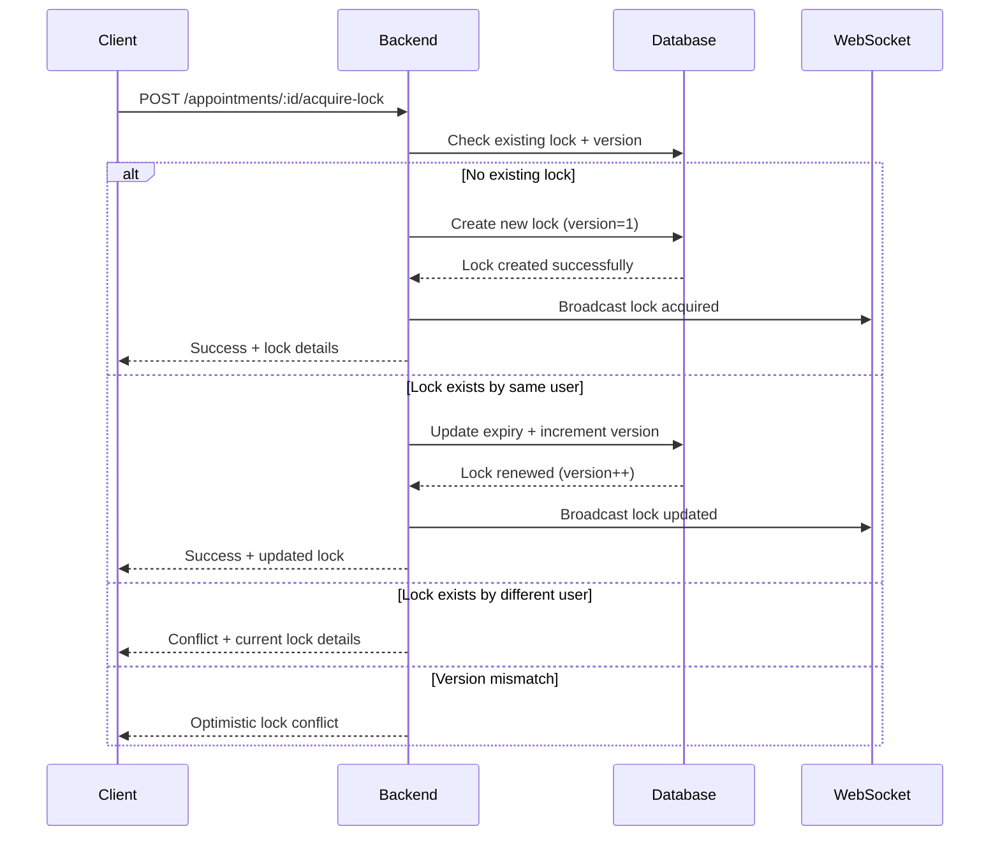
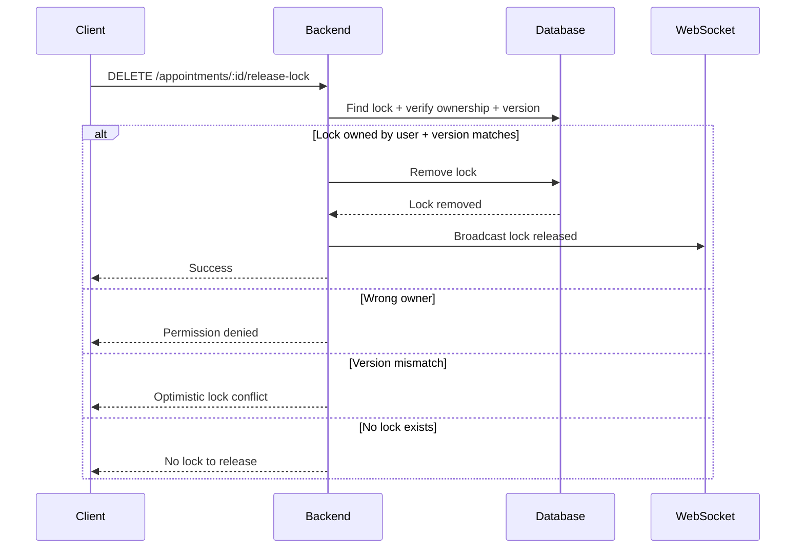

# Appointment Locking Mechanism - Architecture Solution

## Overview

This document outlines the complete architecture solution for the appointment editing locking mechanism. The system implements a robust, real-time collaborative editing platform that prevents concurrent edits on appointments through intelligent locking, optimistic concurrency control, and WebSocket-powered real-time synchronization.

## 🏗️ System Architecture

### High-Level Architecture

```
┌─────────────────┐    ┌─────────────────┐    ┌─────────────────┐
│   Frontend      │    │   Backend       │    │   Database      │
│   (Next.js)     │◄──►│   (Node.js)     │◄──►│  (PostgreSQL)   │
│                 │    │                 │    │                 │
│  ┌───────────┐  │    │  ┌───────────┐  │    │  ┌───────────┐  │
│  │ React 19  │  │    │  │ Express   │  │    │  │ TypeORM   │  │
│  │ TypeScript│  │    │  │ TypeScript│  │    │  │ Entities  │  │
│  │ Socket.IO │  │    │  │ Socket.IO │  │    │  │           │  │
│  └───────────┘  │    │  └───────────┘  │    │  └───────────┘  │
└─────────────────┘    └─────────────────┘    └─────────────────┘
        │                        │
        └────────────────────────┘
              WebSocket
         Real-time Updates
```

### Deployment Architecture

```
┌─────────────────────────────────────────────────────────────┐
│                    Hetzner VPS                              │
│  ┌─────────────────┐              ┌─────────────────────┐   │
│  │   Frontend      │              │   Backend           │   │
│  │ appointment-ui  │              │  appointment-api    │   │
│  │ .lutfifadlan.com│              │ .lutfifadlan.com    │   │
│  │    (Port 3000)  │              │    (Port 8088)      │   │
│  └─────────────────┘              └─────────────────────┘   │
│           │                                │                │
│           └────────────────────────────────┘                │
│                                                             │
│  ┌─────────────────────────────────────────────────────────┐│
│  │                 Coolify                                 ││
│  │            (Container Orchestration)                    ││
│  └─────────────────────────────────────────────────────────┘│
└─────────────────────────────────────────────────────────────┘
```

## 🛠️ Technology Stack

### Backend Architecture

#### Core Technologies
- **Node.js 22** - Runtime environment with modern ECMAScript support
- **Express.js 4.18** - Web framework for RESTful APIs and middleware
- **TypeScript 5.8** - Type-safe development with strict configuration
- **PostgreSQL** - Primary database with JSONB support for flexible data storage

#### Real-time Communication
- **Socket.IO 4.7** - Bidirectional WebSocket communication
- **Real-time Room Management** - Subscription-based appointment updates
- **Connection Resilience** - Auto-reconnection and error handling

#### Data Layer
- **TypeORM 0.3.24** - Advanced ORM with decorators and migrations
- **Optimistic Locking** - Version-based concurrency control
- **Database Migrations** - Version-controlled schema management
- **Entity Relationships** - Proper foreign key constraints

#### Security & Authentication
- **JWT (jsonwebtoken 9.0)** - Stateless authentication tokens
- **BCrypt 6.0** - Password hashing with salt rounds
- **CORS** - Cross-origin resource sharing configuration
- **Role-based Access Control** - User and admin permissions

### Frontend Architecture

#### Core Technologies
- **Next.js 15.3** - React framework with App Router and server components
- **React 19** - Latest React with concurrent features and suspense
- **TypeScript 5** - Full type safety across the application
- **Tailwind CSS 4** - Utility-first styling with dark mode support

#### UI Components
- **Radix UI** - Accessible, unstyled component primitives
- **Framer Motion 11** - Smooth animations and transitions
- **Lucide React** - Beautiful, customizable icon library
- **Canvas Confetti** - Delightful user feedback animations

#### State Management & Forms
- **React Hook Form 7.57** - Performant forms with validation
- **Zod 3.25** - TypeScript-first schema validation
- **React Context** - Built-in state management for lock state
- **Custom Hooks** - Reusable logic abstraction

#### Real-time Features
- **Socket.IO Client 4.8** - WebSocket client integration
- **Real-time Lock Status** - Live lock state synchronization
- **Collaborative Cursors** - Live user position tracking
- **Auto-reconnection** - Resilient connection management

## 📊 Database Design

### Core Entities

#### AppointmentLockEntity
```typescript
{
  id: UUID (Primary Key)
  appointmentId: string (Indexed)
  userId: string
  userInfo: JSONB {
    name: string
    email: string
    position?: { x: number, y: number }
  }
  createdAt: timestamp
  expiresAt: timestamp
  version: integer (Optimistic Lock Version)
}
```

#### LockHistoryEntity
```typescript
{
  id: UUID (Primary Key)
  appointmentId: string (Indexed)
  userId: string
  userName: string
  userEmail: string
  action: enum (acquired|released|expired|force_released)
  timestamp: timestamp (Indexed)
  duration?: integer (seconds)
  releasedBy?: string (for admin actions)
  lockId?: string (reference to original lock)
  metadata: JSONB {
    userAgent?: string
    sessionId?: string
    optimisticLocking?: boolean
    expectedVersion?: number
    actualVersion?: number
    [key: string]: any
  }
}
```

### Database Indexes
- **appointment_locks.appointment_id** - Fast lock lookups by appointment
- **lock_history.appointment_id** - Efficient history queries
- **lock_history.user_id** - User-specific history queries  
- **lock_history.timestamp** - Chronological history ordering

## 🔒 Locking Mechanism Design

### Core Locking Strategy

#### 1. Optimistic Locking with Versioning
```typescript
interface LockAcquisition {
  appointmentId: string
  userId: string
  userInfo: UserInfo
  expectedVersion?: number // For optimistic locking
}
```

**Design Rationale:**
- Prevents lost updates through version checking
- Allows lock renewal without conflicts
- Provides clear conflict resolution paths
- Maintains data consistency under concurrent access

#### 2. Time-based Lock Expiry
- **Lock Duration:** 5 minutes (300 seconds)
- **Auto-refresh:** Every 4 minutes to prevent expiration
- **Cleanup Process:** Background task removes expired locks every minute
- **Grace Period:** Allows brief network interruptions without lock loss

#### 3. Lock State Management
```typescript
enum LockState {
  UNLOCKED = "unlocked"
  LOCKED_BY_USER = "locked_by_user"
  LOCKED_BY_OTHER = "locked_by_other"
  EXPIRED = "expired"
  CONFLICT = "conflict"
}
```

### Lock Acquisition Flow



### Lock Release Flow



## 🌐 Real-time Communication Architecture

### WebSocket Event System

#### Connection Management
```typescript
// Client subscription to appointment updates
socket.emit('subscribe', appointmentId)
socket.emit('unsubscribe', appointmentId)
```

#### Lock Events
```typescript
// Server to Client Events
'lock-acquired' => { appointmentId, lock: AppointmentLock }
'lock-released' => { appointmentId }  
'lock-update' => { appointmentId, lock: AppointmentLock | null }
'admin-takeover' => { appointmentId, adminId, adminInfo }

// Client to Server Events  
'cursor-position' => { appointmentId, userId, position: {x, y} }
```

#### Collaborative Cursor System
```typescript
interface UserCursor {
  userId: string
  position: { x: number, y: number }
  userInfo: { name: string, email: string }
  color: string
  lastSeen: number
}
```

### Real-time Features Implementation

#### 1. Live Lock Status Updates
- Instant notification when locks are acquired/released
- Real-time lock timer countdown
- Visual indicators for lock ownership and expiry

#### 2. Collaborative Cursor Tracking
- Live mouse position broadcasting
- Color-coded user identification
- Automatic cleanup of inactive cursors (10-second timeout)
- Throttled position updates for performance (200ms intervals)

#### 3. Connection Resilience
- Auto-reconnection with exponential backoff
- Connection state management in React Context
- Graceful handling of network interruptions
- Heartbeat mechanism for connection validation

## 🔐 Security Architecture

### Authentication & Authorization

#### JWT Token Strategy
```typescript
interface JWTPayload {
  userId: string
  email: string
  role: 'user' | 'admin'
  iat: number // issued at
  exp: number // expires at
}
```

#### Role-based Access Control
- **Users:** Can acquire/release locks on their appointments
- **Admins:** Can force-release any lock + administrative overrides
- **Middleware:** Route-level permission validation

### Data Security

#### Input Validation
- **Zod schemas** on frontend for type-safe form validation
- **Request sanitization** on backend before database operations
- **SQL injection prevention** through TypeORM parameterized queries

#### WebSocket Security
- **Connection authentication** via JWT tokens
- **Message validation** for all incoming WebSocket events
- **Rate limiting** to prevent abuse and spam
- **Room-based isolation** - users only receive updates for subscribed appointments

## 🚀 Deployment Architecture

### Infrastructure Setup

#### Hetzner VPS Configuration
- **Operating System:** Ubuntu 22.04 LTS
- **Resources:** 2 vCPU, 4GB RAM, 40GB SSD
- **Network:** IPv4/IPv6 with firewall configuration
- **SSL/TLS:** Automated certificate management

#### Coolify Orchestration
```yaml
# Deployment Configuration
Backend:
  domain: appointment.lutfifadlan.com
  port: 8088
  health_check: /health
  auto_deploy: true
  
Frontend:
  domain: appointment-ui.lutfifadlan.com  
  port: 3000
  build_command: npm run build
  auto_deploy: true
```

### Container Strategy

#### Backend Container (Dockerfile)
```dockerfile
# Multi-stage build for optimization
FROM node:22-alpine AS builder
# Dependencies installation + TypeScript compilation
FROM node:22-alpine AS production  
# Production runtime with minimal footprint
```

#### Frontend Container (Dockerfile)
```dockerfile
# Next.js optimized build
FROM node:18-slim AS base
# Static generation + serverless deployment
FROM base AS runner
# Production server with minimal attack surface
```

### Environment Configuration

#### Backend Environment Variables
```bash
# Database
DB_HOST=postgres
DB_PORT=5432
DB_USERNAME=postgres  
DB_PASSWORD=<secure_password>
DB_NAME=appointment_db

# Authentication
JWT_SECRET=<cryptographically_secure_secret>
JWT_EXPIRES_IN=24h

# Server
PORT=8088
NODE_ENV=production

# WebSocket
WS_CORS_ORIGIN=https://appointment-ui.lutfifadlan.com
```

#### Frontend Environment Variables
```bash
# API Configuration
NEXT_PUBLIC_API_URL=https://appointment.lutfifadlan.com
NEXT_PUBLIC_WS_URL=https://appointment.lutfifadlan.com

# Application
NEXT_PUBLIC_APP_NAME=SyncPoint
NEXT_TELEMETRY_DISABLED=1
```

## 🏆 Key Architecture Decisions

### 1. Optimistic vs Pessimistic Locking

**Decision:** Implemented optimistic locking with version numbers
**Rationale:**
- Better performance for low-contention scenarios
- Prevents deadlocks that can occur with pessimistic locking
- Allows for graceful conflict resolution
- Maintains responsiveness in collaborative environments

**Implementation:**
```typescript
// Every lock operation increments version
lockEntity.version = currentVersion + 1
// Client includes expected version in requests
{ expectedVersion: 5, actualVersion: 6 } // Conflict detected
```

### 2. WebSocket vs Server-Sent Events

**Decision:** Chose Socket.IO WebSocket implementation
**Rationale:**
- Bidirectional communication needed for cursor positions
- Built-in room management for appointment-specific updates
- Auto-reconnection and fallback mechanisms
- Mature ecosystem with extensive documentation

### 3. Lock Duration Strategy  

**Decision:** 5-minute lock expiry with 4-minute auto-refresh
**Rationale:**
- Balances user experience with resource efficiency
- Prevents indefinite locks from abandoned sessions
- Auto-refresh prevents accidental expiry during active editing
- Short enough to minimize blocking other users

### 4. Database Choice: PostgreSQL vs MongoDB

**Decision:** PostgreSQL with JSONB for flexible data
**Rationale:**
- ACID compliance for critical locking operations
- JSONB support provides NoSQL flexibility when needed
- Excellent TypeORM integration with migrations
- Superior performance for concurrent read/write operations

### 5. State Management: Context vs Redux

**Decision:** React Context with custom hooks
**Rationale:**
- Simpler setup and maintenance for lock-specific state
- Built-in React solution reduces bundle size
- Custom hooks provide clean API abstraction
- Sufficient for application's state complexity

### 6. Real-time Architecture: Polling vs WebSocket

**Decision:** WebSocket-first with REST API fallback
**Rationale:**
- Instant updates for better user experience
- Reduced server load compared to frequent polling
- Enables collaborative features like cursor tracking
- Maintains REST API for compatibility and debugging

## 🧪 Testing Strategy

### Backend Testing

#### Unit Tests
- **Lock Service Logic:** Acquisition, release, conflict resolution
- **WebSocket Service:** Event broadcasting and room management
- **Authentication:** JWT validation and role-based access
- **Database Operations:** Entity creation, updates, and queries

#### Integration Tests
- **API Endpoints:** Full request/response cycle testing
- **Database Transactions:** Lock consistency under concurrent access
- **WebSocket Events:** Real-time communication flow

#### End-to-End Tests
- **Lock Workflows:** Complete user scenarios from frontend to database
- **Conflict Resolution:** Multiple user concurrent access patterns
- **Admin Operations:** Force-release and takeover scenarios

### Frontend Testing

#### Component Tests
- **Lock Indicators:** Visual state representation
- **Form Validation:** Input validation and error handling
- **Real-time Updates:** WebSocket event handling

#### Integration Tests
- **API Communication:** HTTP client interaction
- **State Management:** Context provider and hook behavior
- **User Flows:** Complete appointment management workflows

## 📈 Performance Optimizations

### Backend Optimizations

#### Database Performance
- **Connection Pooling:** Efficient database connection management
- **Query Optimization:** Strategic indexing on frequently queried fields
- **Background Cleanup:** Scheduled expired lock removal
- **Prepared Statements:** SQL injection prevention with performance benefits

#### Memory Management
- **Lock Caching:** In-memory storage for frequently accessed locks
- **Connection Management:** WebSocket connection pooling
- **Garbage Collection:** Proper cleanup of expired resources

### Frontend Optimizations

#### Rendering Performance
- **React 19 Features:** Concurrent rendering and automatic batching
- **Component Memoization:** Preventing unnecessary re-renders
- **Code Splitting:** Lazy loading of non-critical components
- **Image Optimization:** Next.js automatic image optimization

#### Network Efficiency
- **API Response Caching:** Intelligent cache invalidation strategies
- **WebSocket Message Throttling:** Reduced cursor update frequency
- **Debounced User Input:** Minimized API calls during typing

## 🔍 Monitoring & Observability

### Backend Monitoring

#### Application Metrics
- **Lock Acquisition Rates:** Success/failure ratios
- **WebSocket Connections:** Active connections and events per second
- **API Response Times:** Endpoint performance tracking
- **Database Query Performance:** Slow query identification

#### Health Checks
```typescript
// Health endpoint implementation
GET /health => {
  status: 'healthy',
  timestamp: '2024-01-01T00:00:00Z',
  database: 'connected',
  websocket: 'active'
}
```

### Frontend Monitoring

#### User Experience Metrics
- **Real-time Connectivity:** WebSocket connection success rates
- **Lock Operation Latency:** Time from user action to feedback
- **Error Tracking:** Client-side error reporting and analysis

## 🚀 Future Enhancements

### Short-term Improvements

#### Enhanced Collaborative Features
- **Voice/Video Integration:** Built-in communication tools
- **Comment System:** Appointment-specific discussion threads
- **Revision History:** Track all appointment changes over time
- **Conflict Resolution UI:** Visual diff and merge tools

#### Administrative Features
- **Lock Analytics Dashboard:** Usage patterns and statistics
- **User Activity Monitoring:** Session tracking and audit logs
- **Advanced Role Management:** Custom permission sets
- **Bulk Operations:** Mass appointment management tools

### Long-term Roadmap

#### Scalability Enhancements
- **Microservices Architecture:** Service decomposition for independent scaling
- **Redis Integration:** Distributed lock management and caching
- **Database Sharding:** Horizontal scaling for large datasets
- **CDN Integration:** Global content delivery optimization

#### AI-Powered Features
- **Smart Scheduling:** AI-based optimal appointment timing
- **Conflict Prediction:** Proactive scheduling conflict prevention
- **Usage Analytics:** Machine learning insights for usage patterns
- **Automated Resolution:** AI-assisted conflict resolution suggestions

## 📚 Documentation & Resources

### API Documentation
- **OpenAPI/Swagger:** Complete API specification
- **Postman Collection:** Updated collection with all endpoints
- **WebSocket Events:** Comprehensive event documentation
- **Authentication Guide:** JWT implementation details

### Developer Resources
- **Setup Instructions:** Local development environment
- **Contributing Guidelines:** Code standards and PR process
- **Architecture Diagrams:** Visual system representations
- **Troubleshooting Guide:** Common issues and solutions

---

## 🎯 Summary

This appointment locking mechanism represents a comprehensive solution for preventing concurrent editing conflicts in collaborative applications. The architecture combines robust backend services with a modern, responsive frontend to deliver a seamless user experience.

**Key Achievements:**
- ✅ Complete lock workflow implementation with optimistic concurrency control
- ✅ Real-time collaboration features with WebSocket integration
- ✅ Comprehensive admin override and force-release capabilities
- ✅ Full audit trail with lock history and statistics
- ✅ Production deployment on Hetzner VPS with Coolify orchestration
- ✅ Extensive testing coverage for critical user workflows
- ✅ Modern, accessible UI with collaborative cursor tracking

The system successfully eliminates scheduling conflicts while enabling seamless real-time collaboration, making it an ideal solution for appointment management in professional environments.

**Live Deployment:**
- **Backend API:** https://appointment.lutfifadlan.com/
- **Frontend Application:** https://appointment-ui.lutfifadlan.com/

This architecture provides a solid foundation that can scale from small teams to enterprise-level deployments while maintaining high performance and reliability standards.
